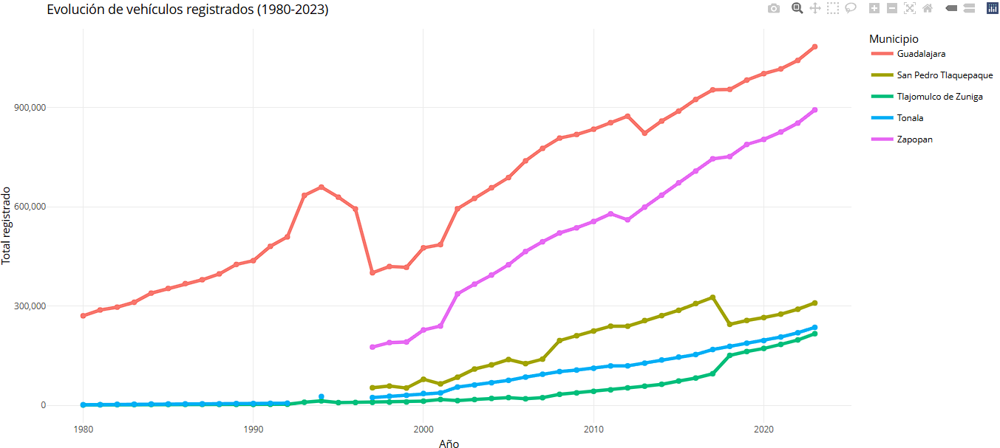

# 📊 Análisis del Uso de Transporte en Guadalajara (2025)

## 🚀 Descripción del Proyecto

Este proyecto analiza los tipos de transporte más utilizados en Guadalajara, Jalisco, agrupándolos en tres categorías:  
- **Transporte Público** (camión, tren ligero, MiBici)  
- **Transporte Privado** (Uber, Didi, entre otras plataformas)  
- **Transporte Personal** (bicicleta, motocicleta, automóvil propio)

El objetivo es calcular el porcentaje de usuarios por categoría, visualizar los resultados y detectar patrones que ayuden a entender la movilidad actual en la ciudad.

---

## 🛠️ Herramientas Utilizadas

- **SQL**: para la gestión y consultas de datos.
- **R**:
  - Librerías: `ggplot2`, `readr`, `DBI`, `RMySQL`
- **FPDF (Python)**: para generación de documentos PDF.
- **Git & GitHub**: control de versiones y publicación.

---

## 📂 Estructura del Repositorio
---

## 📥 Cómo Reproducir el Proyecto

1. Clona este repositorio:
   ```bash
   git clone https://github.com/Simei97/AnalisisUsoTransporteGDL.git

2. Instala las dependencias necesarias en R:
   ```bash
   install.packages(c("ggplot2", "readr", "DBI", "RMySQL"))
   
3. Corre los scripts desde la carpeta **scripts/:**
   - Para analizar los datos desde un **.csv**
   - O conectar a la base de datos en SQL si prefieres
  
4. Explora los gráficos en la carpeta **images/**

## 📊 Resultados
Ejemplo de visualización generada:


## 📚 Fuentes de datos
- [IMEPLAN - Encuesta Origen Destino](https://imeplan.mx/)
- [Gobierno de Jalisco - Movilidad](https://www.jalisco.gob.mx/es/gobierno/organismos/movilidad)

## 🧑‍💻 Autor
- Simei97
- [Mi perfil de GitHub](https://github.com/Simei97)
